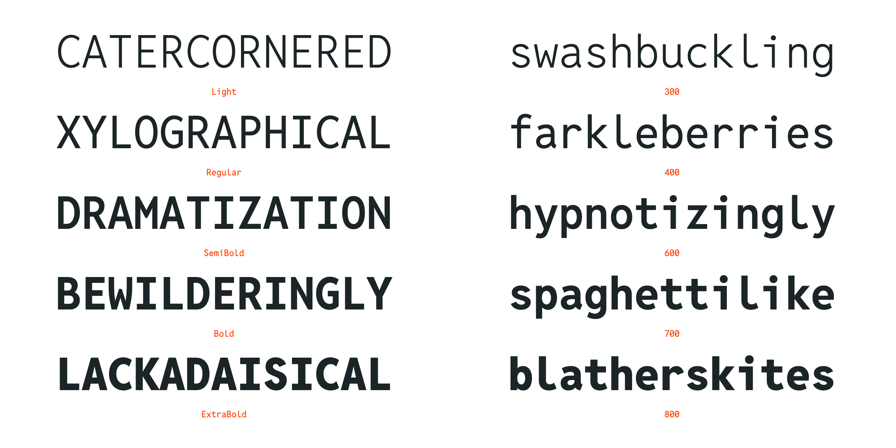

# Reddit Sans

## Fonts

Reddit Sans, Reddit Mono and Reddit Condensed font files can be found in the
`fonts` directory. Both TrueType and WOFF/WOFF2 files are available.

## Source Files

The `src` directory contains the [Glyphs](https://glyphsapp.com/) files for each
set of fonts, and the project files used to output the various subsets.

## Specimen

The `specimen` directory contains source files for the
[microsite](https://redditsans.s-ings.com/).

## Licence

Copyright © 2020-23, Reddit, Inc. (https://www.reddit.com) This Font Software is
licensed under the SIL Open Font License, Version 1.1. See
[OFL.txt](./OFL.txt) and the [OFL-FAQ](./documentation/OFL-FAQ.txt) for more
information.
